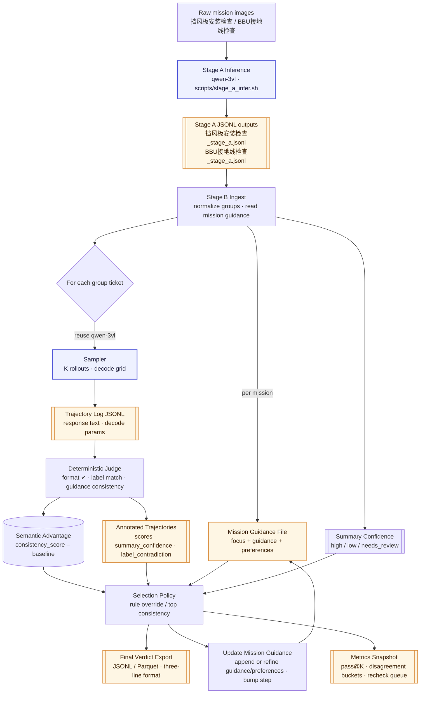

### Iterative Training-Free Cycle

1. **Baseline** — mission guidance for `挡风板安装检查` only contains focus and a rule “挡风板缺失→不通过”.
2. **Rollout** — sampler (K=4) generates verdicts for `QC-TEMP-20241206-0015502`; judge finds one consistent candidate, others lack备注 coverage and inherit `summary_confidence=low`.
3. **Semantic advantage** — consistent candidate scores +0.35 over baseline, negative scores highlight missing evidence in the rest while flagging `needs_review` due to low summary confidence.
4. **Guidance update** — operator records a new prompt cue "判断前确认备注是否强调未安装", step increments and snapshot is stored; preference for low-confidence summaries emphasises conservative verdicts.
5. **Re-run** — rerolling yields two consistent candidates; selection chooses the higher score, exports a three-line verdict (verdict, rationale, confidence), and logs improved pass@K while clearing the recheck flag (no label contradiction).
6. **Next iteration** — continue across other tickets, only promoting durable guidance tweaks while immutable focus (from `STAGE_B_MISSION_FOCUS`) remains untouched.